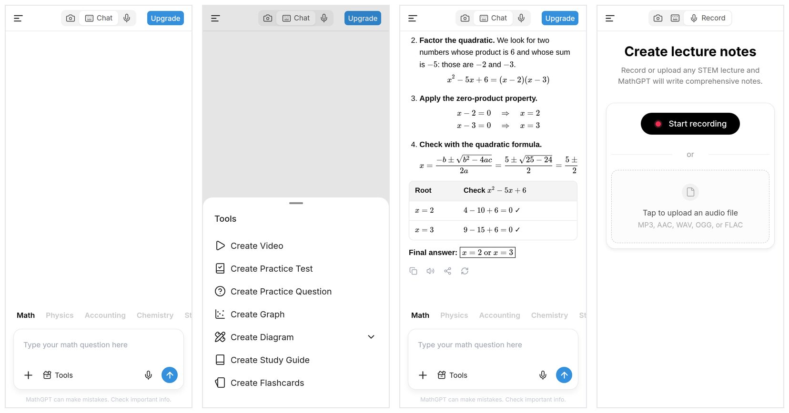
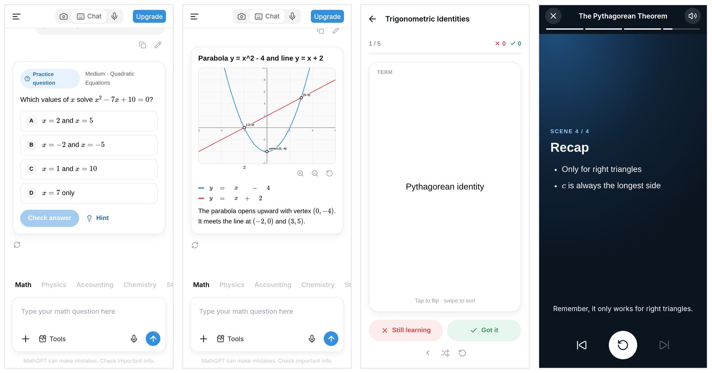
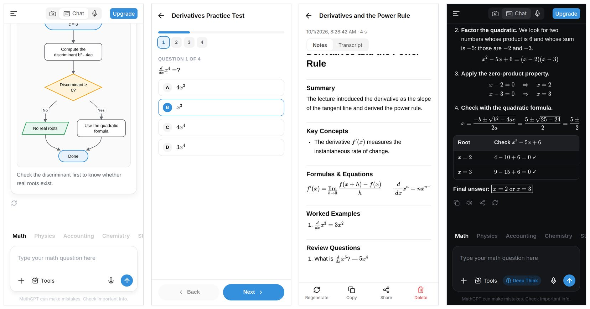

# MathGPT × DeepSeek

A React Native (Expo) copy of the **MathGPT** mobile app, powered by the **DeepSeek API**.
Ask any STEM question, snap a photo of a problem, record a lecture and get notes, or generate
practice tests, flashcards, graphs, diagrams, study guides and narrated video lessons.





## Features

| | |
|---|---|
| **Math keyboard** | The **∑** button in the composer opens a structured math editor ([MathLive](https://mathlive.io), with an on-screen math keyboard) for fractions, powers, roots and symbols; **Insert** adds it to your question as LaTeX. Works offline. |
| **Chat** | Step-by-step answers for 10 subjects (Math, Physics, Accounting, Chemistry, Statistics, Biology, Economics, Finance, Computer Science, Engineering). Streaming Markdown with **LaTeX math** (KaTeX, incl. `\ce{}` chemistry), tables and code. Fractions are always stacked and symbols typeset, even when the model or student types plain text like `6/4`, `x^2`, `sqrt(16)` or `a <= b`. Copy, share, read aloud, regenerate, edit. |
| **Answer styles** | Step by step, **Tutor mode** (Socratic: hints first, the student does the steps), Just the answer, Explain simply, Exam-style working. Pick one from the **+** menu or Settings. |
| **Check My Work** | Photograph or type your own working; the reply gives a verdict, marks each step and explains the first mistake with a corrected solution. |
| **Deep Think** | DeepSeek thinking mode with a live, collapsible chain of thought and adjustable reasoning effort. On by default for every model (Flash included) and used for study tools and lecture notes too. |
| **Scan** | In-app camera with a resizable crop frame (or pick from photos). The photo goes straight to DeepSeek's vision model. If a photo holds several exercises, the app asks which one to solve (or all of them). |
| **Share to the app** | Share a screenshot or photo (or text) from any app's share sheet: it lands in the composer ready to solve. Uses `expo-sharing`'s share extension (experimental), so it needs a development or production build, not Expo Go. |
| **Record** | "Create lecture notes": record a lecture (live transcript) or upload MP3/AAC/WAV/OGG/FLAC, then DeepSeek writes structured notes with formulas, examples and review questions. **Study this lecture** turns the notes into flashcards, a practice test or a study guide, or opens a chat grounded in them (**Ask about it**). |
| **Tools** | Check My Work, Create Video (animated slides + text-to-speech narration), Practice Test (scored, with review and **Practice my mistakes**, which writes a new test aimed at the questions you missed), Practice Question (interactive, hints, solution; **Another question** gets harder after a right answer and easier after a wrong one), Graph (pan/zoom plot), Diagram (flowchart, mind map, geometry, free-body, Venn), Study Guide, Flashcards (flip + swipe, with spaced repetition: every "Got it" / "Still learning" schedules the card, and decks with cards due show under **Review today** in the drawer). |
| **PDF export** | Save answers and study guides (chat actions), lecture notes, practice tests (questions, then the answer key on its own page) and flashcards as PDFs to share or print. Math prints as native MathML. |
| **History** | Chats and notes are saved on the device; searchable drawer grouped by date; rename/delete. |
| **Backup** | Settings → Backup saves chats (with photos), notes, flashcard progress, usage and settings (never API keys) to a JSON file; restoring merges it in without deleting anything. |
| **Usage** | Tokens per chat (long-press it in the drawer), per lecture note, this month and all time, per model. Enter DeepSeek's prices in Settings to see costs too. |
| **Upgrade** | Instead of a paywall, picks the model: *Flash* (fast, reads photos) or *Pro* (strongest reasoning). |
| **Themes** | Light, dark or system. |

## Quick start

You need Node 20+ and a DeepSeek API key from [platform.deepseek.com](https://platform.deepseek.com/api_keys).

```bash
npm install
npx expo start
```

Scan the QR code with **Expo Go** (Android/iOS), open **☰ → Settings**, paste your API key and tap
**Test connection**. Chat, photos, tools and lecture-file upload with cloud transcription all work in Expo Go.

> **Voice input and live lecture transcription** use on-device speech recognition
> (`expo-speech-recognition`), which isn't part of Expo Go. Use a development/production build
> (below), or set **Settings → Speech to text → Cloud** with any OpenAI-compatible
> `/audio/transcriptions` endpoint (OpenAI Whisper, Groq, a self-hosted whisper server).
> DeepSeek itself has no speech API.

### Install an APK on your phone (recommended)

Builds in the cloud with [EAS](https://docs.expo.dev/build/introduction/) (free tier) — no Android Studio needed:

```bash
npx eas-cli@latest login
npx eas-cli@latest build -p android --profile preview   # produces an installable .apk
```

For a development build with fast refresh: `npx eas-cli@latest build -p android --profile development`,
or locally with Android Studio: `npm run android:dev-build`.

### Try it without an API key

A mock server streams canned answers in DeepSeek's exact format (including thinking and every tool):

```bash
npm run mock          # http://0.0.0.0:8787
```

In the app set **Settings → API base URL** to `http://<your-computer-ip>:8787` and use any key.

### Optional: build-time key for development

Create `.env.local` with `EXPO_PUBLIC_DEEPSEEK_API_KEY=sk-...`. `EXPO_PUBLIC_` values are embedded in
the JavaScript bundle, so **never ship a build made this way**. Keys entered in Settings are stored in
the iOS Keychain / Android Keystore instead.

## DeepSeek models & settings

| Setting | Default | Notes |
|---|---|---|
| Model | `deepseek-flash` | DeepSeek V4.1 Flash; accepts images. `deepseek-v4-pro` is the strongest text model. Any custom model ID can be entered. |
| Deep Think | on | Sends `thinking: {type: "enabled"}` and `reasoning_effort` (low/high/max) for answers, study tools and notes, on every model. The app always sends the flag explicitly. If an endpoint refuses JSON mode together with thinking, tools retry without `response_format`. |
| API base URL | `https://api.deepseek.com` | Point it at your own proxy to keep keys off devices (see Security). |

Photos are always routed to a vision-capable model. Tools use JSON mode (`response_format: json_object`)
with schema validation, LaTeX-safe JSON repair and one automatic retry.

**Answer checking.** Practice tests and questions are solved a second time without the answer key
(`src/lib/tools/verify.ts`). A test drops questions where the two solves disagree (keeping at least 4); a
single question is rewritten once and, if the rewrite still disagrees, shown with a "double-check this one"
note. Graph key points that don't lie on any plotted curve are removed.

## How it's built

- **Expo SDK 57**, React Native 0.86, React 19.2 + React Compiler, **Expo Router** (drawer + stack), TypeScript.
- **DeepSeek client** (`src/lib/deepseek/`): SSE streaming over `expo/fetch`, separate `reasoning_content`
  stream, `reasoning_content` round-trip for multi-turn thinking mode, friendly errors for 401/402/429/5xx,
  automatic retry with backoff for rate limits, overload and network errors (only before any text has streamed).
- **Chat history** is capped at about 48K tokens per request: the opening message and the latest turns are kept,
  older turns in between are dropped. Chat titles are written by Flash.
- **Rich content** is rendered with [Expo DOM components](https://docs.expo.dev/guides/dom-components/)
  (`'use dom'`): Markdown (`marked`) + KaTeX, interactive graphs/diagrams/tests/flashcards. The chat
  transcript is one WebView; streamed tokens are pushed into it imperatively so the whole conversation
  isn't re-sent over the bridge for every token. KaTeX fonts are inlined (`npm run katex:css`) so math
  renders offline inside the WebView.
- **Math formatting** (`src/lib/math/`): before rendering, math written as plain text ("6/4",
  "x^2 - 5x + 6 = 0", "sqrt(16)", "a <= b", "2H2 + O2 -> 2H2O") is detected and turned into TeX, and
  loose TeX is cleaned up (slash fractions → `\frac`, `<=` → `\le`, …), so fractions are stacked and
  symbols typeset everywhere — answers, thinking, notes, student messages and study tools. Places that
  can't run KaTeX (chat titles, diagram and graph labels) get the Unicode equivalent: "x² − 4", "⁶⁄₄".
- **State**: zustand stores persisted to SQLite key-value storage (`expo-sqlite/kv-store`), one key per
  chat, written only when a chat changes and throttled during streaming. Photos live in the app's
  document directory.
- **Safety**: model output never runs as code — raw HTML is escaped, graph expressions go through a
  small hand-written parser (no `eval`), and model-drawn SVG is sanitized and shown via ``.

```
src/
  app/                    routes: (main) drawer screen, settings, upgrade, notes, practice-test, flashcards, video, image
  components/
    chat/                 composer, subject tabs, tools & "+" sheets, chat screen
    camera/ record/       Scan and Record modes
    dom/                  'use dom' components (Transcript, RichDocument, PracticeTest, Flashcards, VideoScene) + web libs
    drawer/ header/ ui/   navigation chrome and shared UI
  lib/
    deepseek/             API client, SSE parser, errors, models
    chat/                 send/stream/regenerate controller, history → API messages
    tools/                tool generation and JSON normalizers
    speech/               on-device + cloud speech-to-text
  store/                  zustand stores (chats, notes, settings, ui, toast)
scripts/                  mock DeepSeek server, KaTeX CSS generator
```

## Development

```bash
npm test            # Jest unit tests (client, SSE, JSON repair, math parser, markdown/math, layouts, ...)
npm run typecheck
npm run lint
npm run web         # quickest way to iterate on UI in a browser
```

## Security & publishing notes

- A DeepSeek key on a phone can be extracted by its owner. That's fine for personal use; for a public
  release, run a small proxy that holds the key and set **API base URL** to it.
- "MathGPT" is another company's product name, mirrored here to match the original UI. Change
  `APP_NAME` in `src/constants/app.ts`, `name` in `app.json` and the bundle IDs before publishing.
- The "video" tool produces narrated, animated slides played in the app (on-device text-to-speech),
  not an exported video file.
